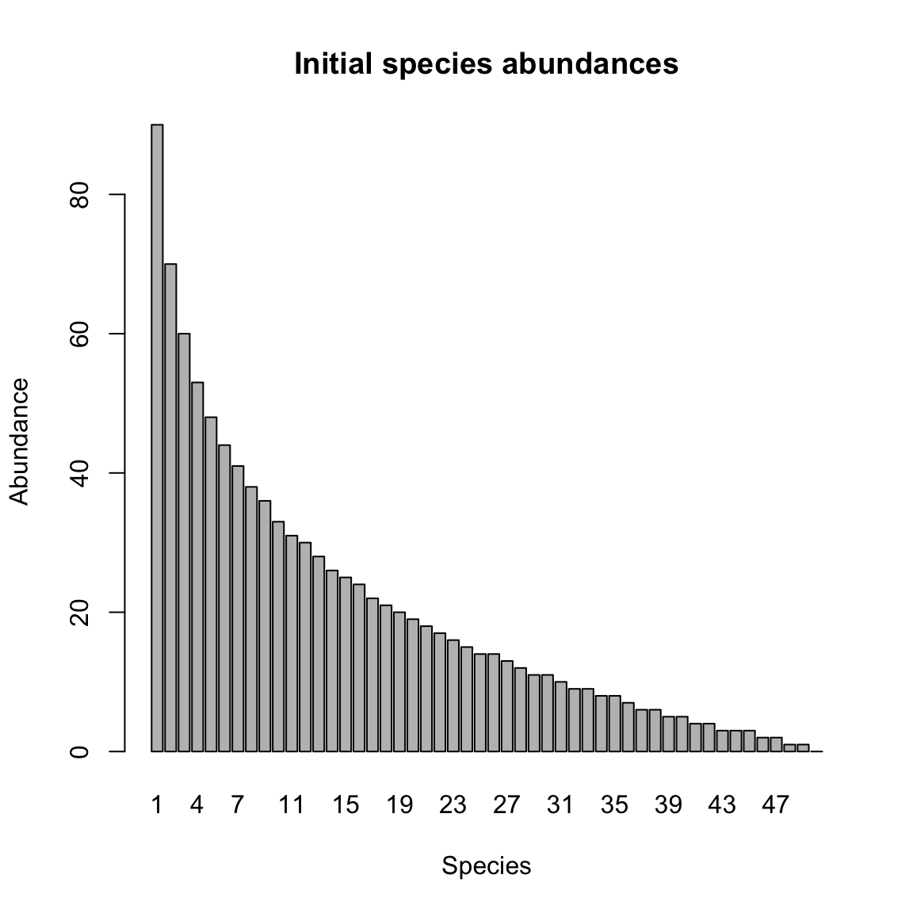
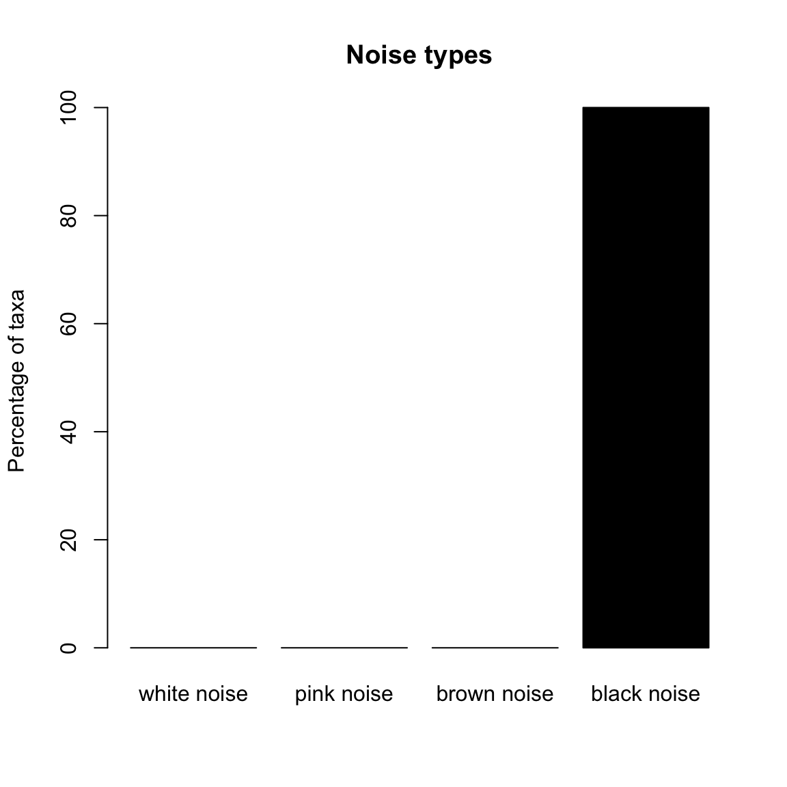
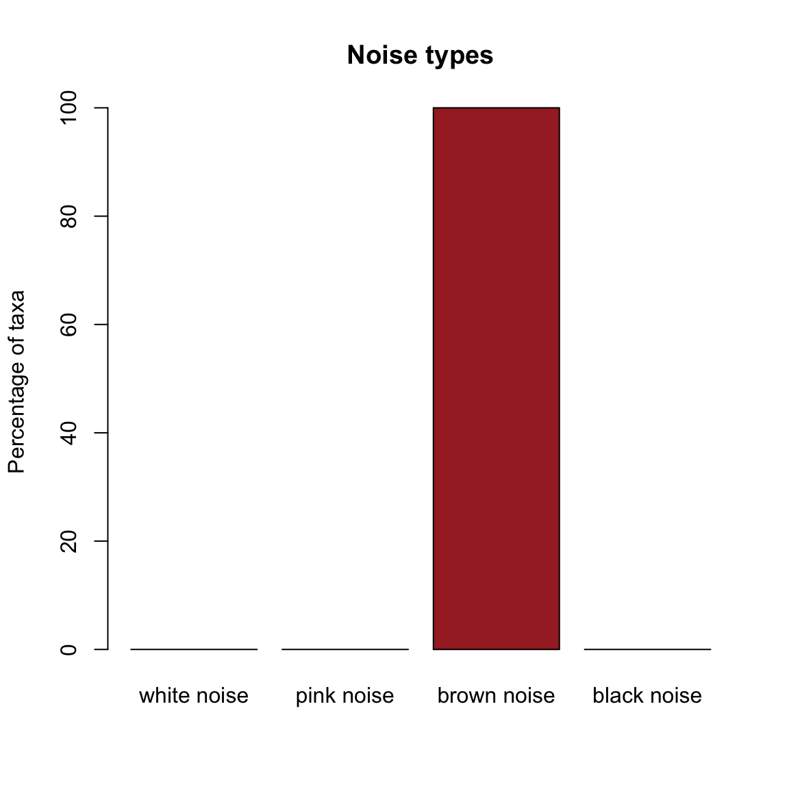
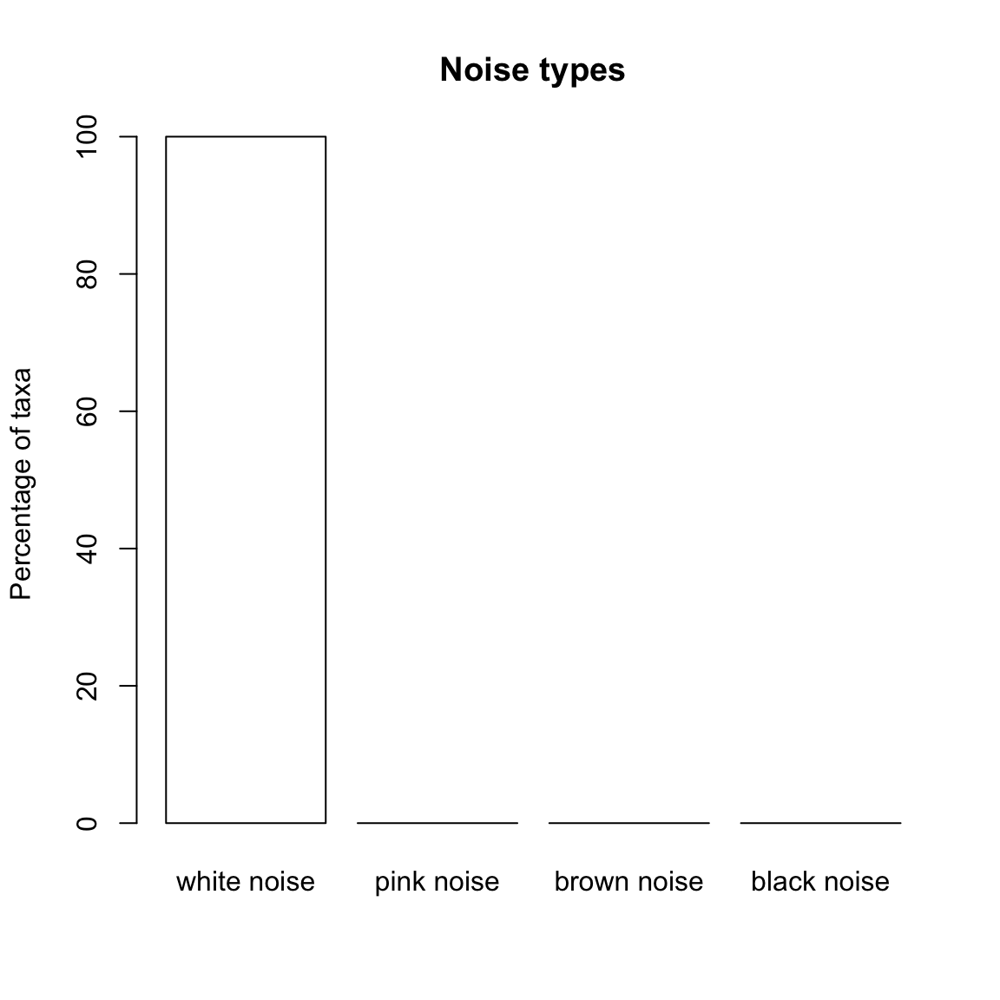

We start by loading the seqtime library.


```r
library(seqtime)
```

Then, we generate a time series with the Ricker community model. For this, we have to specify the number of species N as well as the interaction matrix A that describes their interactions. We generate an interaction matrix with a specified connectance c at random. The connectance gives the percentage of realized arcs out of all possible arcs (arc means that the 
edge is directed).
The diagonal values, which represent intra-species competition, are set to a negative value. In addition, we introduce a high percentage of negative arcs to avoid explosions.


```r
N=50
A=generateA(N, c=0.1, d=-1)
```

```
## [1] "Adjusting connectance to 0.1"
## [1] "Initial edge number 2500"
## [1] "Initial connectance 1"
## [1] "Number of edges removed 2205"
## [1] "Final connectance 0.1"
## [1] "Final connectance: 0.1"
```

```r
A=modifyA(A,perc=70,strength="uniform",mode="negpercent")
```

```
## [1] "Initial edge number 295"
## [1] "Initial connectance 0.1"
## [1] "Number of negative edges already present: 168"
## [1] "Converting 38 edges into negative edges"
## [1] "Final connectance: 0.1"
```

```r
# Generate a matrix using the algorithm by Klemm and Eguiluz to simulate a species network with a more realistic modular and scale-free structure. This takes a couple of minutes to complete.
#A=generateA(N, type="klemm", c=0.1)
```

Next, we generate uneven initial species abundances, summing to a total count of 1000.


```r
y=round(generateAbundances(N,mode=5))
names(y)=c(1:length(y))
barplot(y,main="Initial species abundances",xlab="Species",ylab="Abundance")
```



With the initial abundances and the interaction matrix, we can run a simulation of community dynamics with the Ricker model and plot the resulting time series. 


```r
# convert initial abundances in proportions (y/sum(y)) and run without a noise term (sigma=-1)
out.ricker=ricker(N,A=A,y=(y/sum(y)),K=rep(0.1,N), sigma=-1,tend=500)
tsplot(out.ricker,type="l",header="Ricker")
```


We can then analyse the community time series. First, we plot for each species
the mean against the variance. If a straight line fits well in log scale,
the Taylor law applies.


```r
# the pseudo-count allows to take the logarithm of species hat went extinct
ricker.taylor=seqtime::taylor(out.ricker, pseudo=0.0001, col="green", type="taylor")
```

```
## [1] "Adjusted R2: 0.056685808324661"
```


Now we look at the noise types of the species simulated with the noise-free Ricker model. The only noise type identified is black noise.


```r
ricker.noise=identifyNoisetypes(out.ricker, abund.threshold = 0)
```

```
## [1] "Number of taxa below the abundance threshold:  1"
## [1] "Number of taxa with non-significant power spectrum laws:  0"
## [1] "Number of taxa with non-classified power spectrum:  0"
## [1] "Number of taxa with white noise:  0"
## [1] "Number of taxa with pink noise:  0"
## [1] "Number of taxa with brown noise:  0"
## [1] "Number of taxa with black noise:  49"
```

```r
plotNoisetypes(ricker.noise)
```



Next, we run the SOI model on the same interaction matrix and initial abundances. For the example, we run it with only 500 individuals and 100 generations.


```r
out.soi=soi(N, I=500, A=A, m.vector=y, tend=100)
tsplot(out.soi,type="l",header="SOI")
```


The Taylor law fits far better to time series generated with the SOI than with the Ricker model according to the adjusted R2.


```r
soi.taylor=seqtime::taylor(out.soi, pseudo=0.0001, col="blue", type="taylor")
```

```
## [1] "Adjusted R2: 0.979020201012835"
```


When we compute noise types in the community time series generated with SOI, we find that pink noise dominates.


```r
soi.noise=identifyNoisetypes(out.soi,abund.threshold=0)
```

```
## [1] "Number of taxa below the abundance threshold:  1"
## [1] "Number of taxa with non-significant power spectrum laws:  11"
## [1] "Number of taxa with non-classified power spectrum:  24"
## [1] "Number of taxa with white noise:  0"
## [1] "Number of taxa with pink noise:  11"
## [1] "Number of taxa with brown noise:  3"
## [1] "Number of taxa with black noise:  0"
```

```r
plotNoisetypes(soi.noise)
```


Next, we generate a community time series with the Hubbell model, which describes neutral community dynamics. We set the number of species in the local and in the meta-community as well as the number of deaths to N and assign 1500 individuals. The immigration rate m is set to 0.1. We skip the first 500 steps of transient dynamics. 


```r
out.hubbell=simHubbell(N=N, M=N,I=1500,d=N, m.vector=(y/sum(y)), m=0.1, tskip=500, tend=1000)
tsplot(out.hubbell,type="l",header="Hubbell")
```


The neutral dynamics fits the Taylor law well:


```r
hubbell.taylor=seqtime::taylor(out.hubbell, pseudo=0.0001, col="blue", type="taylor")
```

```
## [1] "Adjusted R2: 0.910522223156054"
```


The Hubbell time series is dominated by brown noise:


```r
hubbell.noise=identifyNoisetypes(out.hubbell,abund.threshold=0)
```

```
## [1] "Number of taxa below the abundance threshold:  1"
## [1] "Number of taxa with non-significant power spectrum laws:  0"
## [1] "Number of taxa with non-classified power spectrum:  29"
## [1] "Number of taxa with white noise:  0"
## [1] "Number of taxa with pink noise:  0"
## [1] "Number of taxa with brown noise:  20"
## [1] "Number of taxa with black noise:  0"
```

```r
plotNoisetypes(hubbell.noise)
```



Finally, we generate a community with the Dirichlet Multinomial distribution, which in contrast to the three previous models does not introduce a dependency between time points.


```r
dm.uneven=simCountMat(N,samples=100,mode=5,k=0.05)
tsplot(dm.uneven,type="l",header="Dirichlet-Multinomial")
```


We plot its Taylor law.


```r
dm.uneven.taylor=seqtime::taylor(dm.uneven, pseudo=0.0001, col="orange", type="taylor", header="Dirichlet-Multinomial")
```

```
## [1] "Adjusted R2: 0.984134135763677"
```


As expected, samples generated with the Dirichlet-Multinomial distribution do not display pink, brown or black noise. 


```r
dm.uneven.noise=identifyNoisetypes(dm.uneven,abund.threshold=0)
```

```
## [1] "Number of taxa below the abundance threshold:  0"
## [1] "Number of taxa with non-significant power spectrum laws:  46"
## [1] "Number of taxa with non-classified power spectrum:  4"
## [1] "Number of taxa with white noise:  0"
## [1] "Number of taxa with pink noise:  0"
## [1] "Number of taxa with brown noise:  0"
## [1] "Number of taxa with black noise:  0"
```

```r
plotNoisetypes(dm.uneven.noise)
```



The evenness of the species proportion vector given to the Dirichlet-Multinomial distribution influences the slope of the Taylor law:


```r
dm.even=simCountMat(N,samples=100,mode=1)
dm.even.taylor=seqtime::taylor(dm.even, pseudo=0.0001, col="orange", type="taylor", header="Even Dirichlet-Multinomial")
```

```
## [1] "Adjusted R2: 0.355717117410069"
```


## Noise simulation

For further examples on simulating noise, see [noise_simulations.md](noise_simulations.md).
